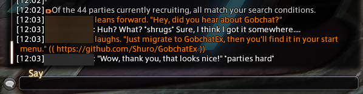
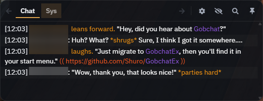

# GobchatEx

**A modern FFXIV chat overlay for roleplayers.**

**English** · [Deutsch](README_de.md) · [Changelog](CHANGELOG.md)

> [!NOTE]
> **GobchatEx is a community fork of [MarbleBag/Gobchat](https://github.com/MarbleBag/Gobchat)** (AGPL-3.0), modernized and maintained by Shuro.
> It took a lot of inspiration from [quisquous cactbot](https://github.com/quisquous/cactbot) and uses the excellent [Sharlayan](https://github.com/FFXIVAPP/sharlayan) module from FFXIVAPP to read FFXIV's memory.

## What is it?

GobchatEx is a Windows overlay that floats on top of Final Fantasy XIV and gives roleplayers a far better chat experience - readable colors, smart highlighting, distance-aware filtering, and grouping, all rendered over the game without getting in the way.

The same message, plain in-game and then through GobchatEx:

| In-game | With GobchatEx |
|:---:|:---:|
|  |  |

## Features

- **Roleplay-aware formatting** - automatic colors for speech, emotes and OOC comments, plus tunable tab styles and chat density.- **Chat tabs** - create as many tabs as you like and choose which channels each one shows and how it's formatted.
- **Smart highlighting (mentions)** - a case-insensitive word list that always highlights, **plus per-character player mentions** that learn each character you log in as and highlight their name. Opt-in **fuzzy**, **partial-name** and **Miqo'te** matching catch typos and name fragments.- **Range filter** - fade out or hide messages by how far away the speaker is (measured live from the game, in yalms).
- **Groups** - sort players into the game's seven groups *and* any number of your own; each group is named, toggleable and styled. Right-click a player in the overlay to add or remove them from a custom group on the spot.
- **Hide individual lines** - right-click any line to hide it; reveal hidden lines again with the closed-eye toolbar button (session-only).
- **Chat log** - optionally write your chat history to a file with a customizable format.
- **Smart autoscroll** - scroll up to read in peace; new messages stop pushing the view. Scroll back to the bottom to re-enable it.
- **Draggable & resizable** - click the pin button to unlock the overlay, drag it by its toolbar and resize from any edge; position and size are saved automatically.
- **Global hotkeys** - bind *Show & Hide* and *Focus search* under *Settings → App → Hotkeys*.

## Installation

The easiest way to install GobchatEx is the **installer** - it sets everything up for you and enables in-app auto-updates.

1. Go to the [latest release](https://github.com/Shuro/GobchatEx/releases/latest) and download **`GobchatEx-win-Setup.exe`**.
2. Run it. GobchatEx installs per-user (no admin prompt) and starts when it's done.

> [!IMPORTANT]
> GobchatEx's UI is rendered with the **Microsoft Edge WebView2 Runtime** (Evergreen), which ships with current Windows 10/11. The installer **provisions it automatically** if it's missing, and the .NET runtime is bundled - so nothing else is required.

Prefer a portable build (no installer)?

Download **`GobchatEx-win-Portable.zip`** from the [latest release](https://github.com/Shuro/GobchatEx/releases/latest) instead:

1. Right-click the zip → **Properties** → tick **Unblock** in the bottom-right, then **OK**.
2. Unzip it wherever you like (everything is already inside a `GobchatEx` folder).
3. Open the folder and run **GobchatEx.exe**.

The portable build doesn't provision WebView2, so if GobchatEx won't start, install the [Microsoft Edge WebView2 Runtime](https://developer.microsoft.com/microsoft-edge/webview2/) yourself (it's already present on most up-to-date Windows 10/11).

**Switching from portable to the installer later?** Your settings carry over automatically - both builds keep your profiles in `%AppData%\GobchatEx`, which is separate from the program files. Just run `GobchatEx-win-Setup.exe`, then delete the old portable folder once the installed copy starts (it gives you working auto-updates).

First launch &amp; details

The first time you start GobchatEx it shows a short setup screen before the overlay appears. Pick your **language** and **theme**, choose whether GobchatEx should **automatically check for updates**, and - if it finds an existing `%AppData%\Gobchat` install from the original Gobchat - whether to **import your existing profiles** (the old folder is copied over and left untouched in its original location). Your choices take effect on that first launch and the screen does not appear again; you can change all of them later under *Settings → App*.

GobchatEx renders its UI through the Microsoft Edge WebView2 runtime that ships with Windows, so there is no one-time browser-engine download on first start.

## Updating

Installed builds update themselves: GobchatEx checks on startup and the patch-note screen can download and apply the update for you. (Portable users just download the latest release and replace their files.)

> [!TIP]
> You can also check any time without restarting: open *Settings → About* and click **Check for updates**. On an installed build this can download and apply the update and restart, even when *Check for updates on start* (the *App* page) is turned off.

## Using GobchatEx

A new tray icon appears: a letter **"G"** whose color shows GobchatEx's state at a glance.

- **Black "G"** - running, but not connected to FFXIV (looking for the game).
- **Gold "G"** - connected and the chat overlay is on screen.
- **Black "G" with a gold outline** - connected, but the overlay is currently hidden (e.g. at the title screen, or auto-hidden because another window is focused).

**Tray icon:** left-click shows/hides the overlay, right-click opens a context menu.

**Hotkeys** (*Settings → App → Hotkeys*, off until assigned):
- **Show & Hide** - shows or hides the overlay.
- **Focus search** - brings the overlay forward and puts the cursor straight into its search field.

Running notes, admin rights &amp; closing

- The overlay is not visible in front of FFXIV when the game runs in **full-screen** mode (use borderless/windowed). GobchatEx was written for FFXIV 64-bit, DirectX 11.
- Reaching the gold (connected) state may take a while on your first start. While GobchatEx is still waiting for FFXIV, an on-screen greeter splash is shown; its **X** button quits GobchatEx.
- GobchatEx needs no administrator rights and starts without a UAC prompt. The only exception is when **FFXIV itself runs as administrator** - GobchatEx then can't read its chat and asks whether to restart as administrator. As a rule of thumb, run both as administrator or neither.
- **To close:** right-click the tray icon → *close*.

## Troubleshooting

Common problems

**Range filter seems not to work** - open the *Range Filter* config page; if GobchatEx can't read players from FFXIV, a red message explains why. Make sure FFXIV is running, reopen the config dialog (GobchatEx needs a moment to load), or close GobchatEx and delete the `sharlayan` folder under `resources` so it re-downloads.

**GobchatEx doesn't start** - check `gobchatex_debug.log`. An error mentioning the **WebView2** runtime means the Microsoft Edge WebView2 runtime is missing or out of date - install it from the link under [Installation](#installation).

**"GobchatEx is already running"** - only one copy of GobchatEx can run at a time. If you start it while it's already open you'll see this notice and the second copy closes - the running one is by your clock in the system tray (its "G" icon).

## Support

If GobchatEx makes your roleplay nicer, you can support development on Ko-fi - thank you! 💛

## License

This program is free software: you can redistribute it and/or modify it under the terms of the GNU Affero General Public License (**AGPL-3.0-only**) as published by the Free Software Foundation, version 3. See the [full license text](LICENSE.md) or visit <https://www.gnu.org/licenses/>.

> GobchatEx is a fork of [Gobchat](https://github.com/MarbleBag/Gobchat) by MarbleBag, licensed under AGPL-3.0.

---

© 2010-2026 SQUARE ENIX CO., LTD. All Rights Reserved. A REALM REBORN is a registered trademark or trademark of Square Enix Co., Ltd. FINAL FANTASY, SQUARE ENIX and the SQUARE ENIX logo are registered trademarks or trademarks of Square Enix Holdings Co., Ltd.
